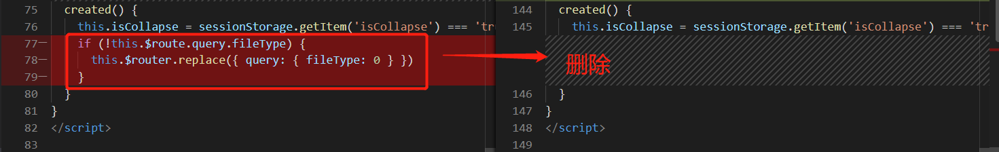

### 使用 NavMenu 实现左侧菜单

在 `src/views/Home` 下创建新的文件夹 `components`，存放独属于首页的组件，后续的面包屑导航栏、表格列筛选组件都会放置于此文件夹下。

在 `src/views/Home/components` 下创建新文件 `SideMenu.vue`，在 `src/views/Home/index.vue` 中添加以下内容来引入、注册并使用此组件：

```
<template>
  <div class="home">
    <!-- 3. 使用组件 -->
    <SideMenu></SideMenu>
  </div>
</template>

<script>
import SideMenu from "./components/SideMenu.vue"; //  1.引入左侧菜单组件

export default {
  name: "Home",
  components: {
    SideMenu, //  2. 注册组件
  },
  data() {
    return {};
  },
  methods: {},
};
</script>
```

参考 Element UI 的 NavMenu（[NavMenu 垂直菜单](https://element.eleme.cn/#/zh-CN/component/menu#ce-lan)），先来实现一个区分文件类型的垂直菜单，在 `SideMenu.vue` 文件中添加以下内容：

```
<template>
  <el-menu
    class="side-menu"
    :default-active="activeIndex"
    :router="true"
    :collapse="isCollapse"
    background-color="#545c64"
    text-color="#fff"
    active-text-color="#ffd04b"
  >
    <el-menu-item index="0" :route="{ name: 'Home', query: { fileType: 0 } }">
      <!-- 图标均来自 Element UI 官方图标库 https://element.eleme.cn/#/zh-CN/component/icon -->
      <i class="el-icon-menu"></i>
      <span slot="title">全部</span>
    </el-menu-item>
    <el-menu-item index="1" :route="{ name: 'Home', query: { fileType: 1 } }">
      <i class="el-icon-picture"></i>
      <span slot="title">图片</span>
    </el-menu-item>
    <el-menu-item index="2" :route="{ name: 'Home', query: { fileType: 2 } }">
      <i class="el-icon-document"></i>
      <span slot="title">文档</span>
    </el-menu-item>
    <el-menu-item index="3" :route="{ name: 'Home', query: { fileType: 3 } }">
      <i class="el-icon-video-camera-solid"></i>
      <span slot="title">视频</span>
    </el-menu-item>
    <el-menu-item index="4" :route="{ name: 'Home', query: { fileType: 4 } }">
      <i class="el-icon-headset"></i>
      <span slot="title">音乐</span>
    </el-menu-item>
    <el-menu-item index="5" :route="{ name: 'Home', query: { fileType: 5 } }">
      <i class="el-icon-takeaway-box"></i>
      <span slot="title">其他</span>
    </el-menu-item>
  </el-menu>
</template>

<script>
export default {
  name: "SideMenu",
  data() {
    return {};
  },
  computed: {
    // 当前激活菜单的 index
    activeIndex() {
      return String(this.$route.query.fileType); //  获取当前路由参数中包含的文件类型
    },
  },
};
</script>
```

接着我们来使用 NavMenu 的 collapse 属性（[NavMenu 折叠](https://element.eleme.cn/#/zh-CN/component/menu#zhe-die)）把左侧菜单的收缩展开功能添加上，并调整样式：

```
<template>
  <!-- collapse 属性：控制菜单收缩展开 -->
  <el-menu
    class="side-menu"
    :default-active="activeIndex"
    :router="true"
    :collapse="isCollapse"
    background-color="#545c64"
    text-color="#fff"
    active-text-color="#ffd04b"
  >
    <div class="fold-wrapper">
      <!-- click事件 当点击时切换菜单的收缩状态 -->
      <i
        class="el-icon-s-unfold"
        v-if="isCollapse"
        title="展开"
        @click="isCollapse = false"
      ></i>
      <i
        class="el-icon-s-fold"
        v-else
        title="收缩"
        @click="isCollapse = true"
      ></i>
    </div>
    <el-menu-item index="0" :route="{ name: 'Home', query: { fileType: 0 } }">
      <i class="el-icon-menu"></i>
      <span slot="title">全部</span>
    </el-menu-item>
    <!-- 剩余代码不再赘述 -->
  </el-menu>
</template>

<script>
export default {
  name: "SideMenu",
  data() {
    return {
      isCollapse: false, //  控制菜单收缩展开
    };
  },
  // 已有代码不再赘述
  watch: {
    // 监听收缩状态变化，存储在sessionStorage中，保证页面刷新时仍然保存设置的状态
    isCollapse(newValue) {
      sessionStorage.setItem("isCollapse", newValue);
    },
  },
  created() {
    this.isCollapse = sessionStorage.getItem("isCollapse") === "true"; //  读取保存的状态
    if (!this.$route.query.fileType) {
      this.$router.replace({ query: { fileType: 0 } });
    }
  },
};
</script>

<style lang="stylus" scoped>
@import '~@/assets/style/mixins.styl';

.side-menu {
  // 高度设置为屏幕高度减去顶部导航栏的高度
  height: calc(100vh - 61px);
  overflow: auto;
  // 调整滚动条样式
  setScrollbar(6px, #909399, #EBEEF5);

  // 折叠图标调整样式
  .fold-wrapper {
    height: 56px;
    line-height: 56px;
    padding: 0 20px;
    text-align: right;
    color: #fff;
    font-size: 24px;

    .el-icon-s-unfold, .el-icon-s-fold {
      cursor: pointer;

      &:hover {
        opacity: 0.5;
      }
    }
  }
}

// 对展开状态下的菜单设置宽度
.side-menu:not(.el-menu--collapse) {
  width: 200px;
}
</style>
```

<style> 中引入的 styl 文件需要在 src/assets/style 中新建 mixins.styl，内容如下：

```stylus
setScrollbar(scrollbarWidth, trackColor = #EBEEF5, thumbColor = #909399)
    //  修改滚动条下面的宽度
    &::-webkit-scrollbar
        width scrollbarWidth
    //  修改滚动条的下面的样式
    &::-webkit-scrollbar-track
        background-color trackColor
        -webkit-border-radius 2em
        -moz-border-radius 2em
        border-radius 2em
    //  修改滑块
    &::-webkit-scrollbar-thumb
        background-color thumbColor
        -webkit-border-radius 2em
        -moz-border-radius 2em
        border-radius 2em
```

### 使用 BreadCrumb 实现面包屑导航


参考官方示例（[BreadCrumb 面包屑导航](https://element.eleme.cn/#/zh-CN/component/breadcrumb#ji-chu-yong-fa)）来实现面包屑导航栏，以显示当前查看的文件的路径。在 `views/Home/components` 目录下新建文件 `BreadCrumb.vue`，添加以下内容：

```
<template>
  <el-breadcrumb class="bread-crumb" separator="/">
    <el-breadcrumb-item :to="{ path: '/' }">全部</el-breadcrumb-item>
    <el-breadcrumb-item>文件夹1</el-breadcrumb-item>
    <el-breadcrumb-item>文件夹1-1</el-breadcrumb-item>
  </el-breadcrumb>
</template>

<script>
export default {
  name: "BreadCrumb",
  data() {
    return {};
  },
};
</script>

<style lang="stylus" scoped>
.bread-crumb {
  height: 28px;
  line-height: 28px;
}
</style>
```

在 `index.vue` 中引入 `BreadCrumb.vue`，调整布局，使菜单居左，右侧内容区域自适应宽度：

```
<template>
  <div class="home">
    <!-- 3. 使用组件 -->
    <!-- 左侧菜单 - 区分文件类型 -->
    <SideMenu class="home-left"></SideMenu>
    <!-- 右侧内容区 -->
    <div class="home-right">
      <!-- 面包屑导航栏 - 显示文件路径 -->
      <BreadCrumb></BreadCrumb>
    </div>
  </div>
</template>

<script>
import SideMenu from "./components/SideMenu.vue"; //  1.引入左侧菜单组件
import BreadCrumb from "./components/BreadCrumb.vue"; //  引入面包屑导航栏

export default {
  name: "Home",
  components: {
    SideMenu, //  2. 注册组件
    BreadCrumb,
  },
  data() {
    return {};
  },
};
</script>

<style lang="stylus" scoped>
.home {
  // 使用flex布局 菜单居左固定宽度 右侧内容区域自适应宽度
  display: flex;

  .home-left {
    box-sizing: border-box;
  }

  .home-right {
    box-sizing: border-box;
    width: calc(100% - 200px);
    padding: 8px 24px;
    flex: 1;
  }
}
</style>
```

### 使用 Table 表格组件实现文件展示


参考官方示例（[Table 表格](https://element.eleme.cn/#/zh-CN/component/table)）来实现文件展示区域。仍然在 `views/Home/components` 下创建文件 `FileTable.vue`，添加以下内容：

```
<template>
  <el-table :data="tableData" style="width: 100%">
    <el-table-column prop="fileName" label="文件名"> </el-table-column>
    <el-table-column prop="extendName" label="类型" width="100">
    </el-table-column>
    <el-table-column prop="fileSize" label="大小" width="60"> </el-table-column>
    <el-table-column prop="uploadTime" label="修改日期" width="180">
    </el-table-column>
    <el-table-column label="操作" width="60"> </el-table-column>
  </el-table>
</template>

<script>
export default {
  name: "FileTable",
  data() {
    return {
      // 表格数据先模拟
      tableData: [
        {
          fileName: "markdown样式文件",
          extendName: "markdown",
          fileSize: "10KB",
          uploadTime: "2020-10-28 16:33:33",
        },
        {
          fileName: "项目源码",
          extendName: "zip",
          fileSize: "7MB",
          uploadTime: "2020-12-28 20:00:50",
        },
      ],
    };
  },
};
</script>
```

在 `index.vue` 中引入：

```
<template>
  <div class="home">
    <!-- 3. 使用组件 -->
    <!-- 左侧菜单 - 区分文件类型 -->
    <SideMenu class="home-left"></SideMenu>
    <!-- 右侧内容区 -->
    <div class="home-right">
      <!-- 面包屑导航栏 - 显示文件路径 -->
      <BreadCrumb></BreadCrumb>
      <!-- 表格组件 - 文件展示区 -->
      <FileTable></FileTable>
    </div>
  </div>
</template>

<script>
import SideMenu from "./components/SideMenu.vue"; //  1.引入左侧菜单组件
import BreadCrumb from "./components/BreadCrumb.vue"; //  引入面包屑导航栏
import FileTable from "./components/FileTable.vue"; //  引入文件表格展示区

export default {
  name: "Home",
  components: {
    SideMenu, //  2. 注册组件
    BreadCrumb,
    FileTable,
  },
  data() {
    return {};
  },
};
</script>
...
```

表格的操作列需要添加对文件操作的按钮：删除、移动、重命名、下载，同时需要支持操作列的展开和收缩两种形态，先来添加下操作列展开状态下的按钮，并为每个按钮先创建好点击事件，写法可以参考官方示例（[Table 自定义列模板](https://element.eleme.cn/#/zh-CN/component/table#zi-ding-yi-lie-mo-ban)），继续编辑 `FileTable.vue` 文件：

```
<template>
  <el-table :data="tableData" style="width: 100%">
    <!-- 已有代码不再赘述 -->
    ...
    <el-table-column label="操作" width="220">
      <template slot-scope="scope">
        <!-- 操作列展开状态下的按钮 -->
        <div class="opera-unfold">
          <el-button
            type="text"
            size="small"
            @click.native="handleClickDelete(scope.row)"
            >删除</el-button
          >
          <el-button
            type="text"
            size="small"
            @click.native="handleClickMove(scope.row)"
            >移动</el-button
          >
          <el-button
            type="text"
            size="small"
            @click.native="handleClickRename(scope.row)"
            >重命名</el-button
          >
          <el-button type="text" size="small">
            <a target="_blank" style="display: block; color: inherit">下载</a>
          </el-button>
        </div>
      </template>
    </el-table-column>
  </el-table>
</template>

<script>
export default {
  name: "FileTable",
  data() {
    return {
      // ……
    };
  },
  methods: {
    // 删除按钮 - 点击事件
    handleClickDelete(row) {
      console.log("删除", row.fileName);
    },
    // 移动按钮 - 点击事件
    handleClickMove(row) {
      console.log("移动", row.fileName);
    },
    // 重命名按钮 - 点击事件
    handleClickRename(row) {
      console.log("重命名", row.fileName);
    },
  },
};
</script>
```

再来添加操作列收缩状态下的按钮，用 Element UI 的下拉菜单（[Dropdown 下拉菜单](https://element.eleme.cn/#/zh-CN/component/dropdown)）来实现：

```
<template>
  <el-table :data="tableData" style="width: 100%">
    <!-- 已有代码不再赘述 -->
    ...
    <!-- 表格操作列 -->
    <el-table-column label="操作" width="260">
      <template slot-scope="scope">
        <!-- 操作列展开状态下的按钮 -->
        <!-- 已有代码不再赘述 -->
        ...
        <!-- 操作列收缩状态下的按钮 -->
        <el-dropdown trigger="click">
          <el-button size="mini">
            操作
            <i class="el-icon-arrow-down el-icon--right"></i>
          </el-button>
          <el-dropdown-menu slot="dropdown">
            <el-dropdown-item @click.native="handleClickDelete(scope.row)"
              >删除</el-dropdown-item
            >
            <el-dropdown-item @click.native="handleClickMove(scope.row)"
              >移动</el-dropdown-item
            >
            <el-dropdown-item @click.native="handleClickRename(scope.row)"
              >重命名</el-dropdown-item
            >
            <el-dropdown-item>
              <a target="_blank" style="display: block; color: inherit">下载</a>
            </el-dropdown-item>
          </el-dropdown-menu>
        </el-dropdown>
      </template>
    </el-table-column>
  </el-table>
</template>
```

来添加下表格操作列收缩和展开状态的切换，将控制切换的入口添加在表格头上，这里需要用到 Element UI 中 Table 组件的自定义表头（[Table 自定义表头](https://element.eleme.cn/#/zh-CN/component/table#zi-ding-yi-biao-tou)），同时将表格列的宽度设置为动态变化，随收缩状态而改变：

```
<template>
  <el-table :data="tableData" style="width: 100%">
    <!-- 已有代码不再赘述 -->
    ...
    <!-- 表格操作列 自定义表格头，原有的 label="操作" 需要删除，宽度动态变化 -->
    <el-table-column :width="operaColumnIsFold ? 200 : 100">
      <!-- 自定义表格头 -->
      <template slot="header">
        <span>操作</span>
        <i
          class="el-icon-circle-plus"
          title="展开"
          @click="operaColumnIsFold = true"
        ></i>
        <i
          class="el-icon-remove"
          title="折叠"
          @click="operaColumnIsFold = false"
        ></i>
      </template>
      <template slot-scope="scope">
        <!-- 操作列展开状态下的按钮 通过v-if控制 -->
        <div class="opera-unfold" v-if="operaColumnIsFold">
          <!-- 已有代码不再赘述 -->
          ...
        </div>
        <!-- 操作列收缩状态下的按钮 通过v-else控制 -->
        <el-dropdown trigger="click" v-else>
          <!-- 已有代码不再赘述 -->
          ...
        </el-dropdown>
      </template>
    </el-table-column>
  </el-table>
</template>

<script>
export default {
  name: 'FileTable',
  data() {
    return {
      // data中已有的数据不再赘述
      ...
      operaColumnIsFold: false //  表格操作列-是否收缩
    }
  },
  watch: {
    // 监听收缩状态变化，存储在sessionStorage中，保证页面刷新时仍然保存设置的状态
    operaColumnIsFold(newValue) {
      sessionStorage.setItem('operaColumnIsFold', newValue)
    }
  },
  created() {
    this.operaColumnIsFold = sessionStorage.getItem('operaColumnIsFold') === 'true' //  读取保存的状态
  },
  ...
}
</script>

<style lang="stylus" scoped>
// 表格操作列-表头图标样式调整
.el-icon-circle-plus, .el-icon-remove {
  margin-left: 8px;
  cursor: pointer;
  font-size: 16px;

  &:hover {
    opacity: 0.5;
  }
}
</style>
```

### 使用 Pagination 组件实现分页


由于网盘中存储的文件会很多，一次性加载所有的文件会降低文件加载速度，且在表格内拖动滚动条的方式在交互上也不够友好，所以需要常见的分页组件来提升查看文件的效率。参考官方示例（[Pagination 分页组件的附加功能](https://element.eleme.cn/#/zh-CN/component/pagination#fu-jia-gong-neng)）中的完整功能，来实现分页组件。仍然在 `views/Home/components` 下创建新文件 `FilePagination.vue`，添加以下内容：

```
<template>
  <el-pagination
    class="file-pagination"
    :current-page="pageData.currentPage"
    :page-size="pageData.pageCount"
    :total="pageData.total"
    :page-sizes="[10, 20, 50, 100]"
    layout="sizes, total, prev, pager, next"
    @current-change="handleCurrentChange"
    @size-change="handleSizeChange"
  >
  </el-pagination>
</template>

<script>
export default {
  name: "FilePagination",
  data() {
    return {
      pageData: {
        currentPage: 1, //   页码
        pageCount: 20, //  每页显示条目个数
        total: 0, //  总数
      },
    };
  },
  methods: {
    // 分页组件 当前页码改变
    handleCurrentChange(currentPage) {
      this.pageData.currentPage = currentPage;
    },
    // 分页组件 每页显示条目个数改变
    handleSizeChange(pageCount) {
      this.pageData.pageCount = pageCount;
    },
  },
};
</script>

<style lang="stylus" scoped>
// 分页组件内容居右显示
.file-pagination {
  margin-top: 16px;
  text-align: right;
}
</style>
```

然后在 `views/Home/index.vue` 文件中添加如下代码：

```
<template>
  <div class="home">
  ...
    <div class="home-right">
      ...
      <FilePagination
        :pageData="pageData"
        @changePageData="changePageData"
      ></FilePagination>
    </div>
  </div>
</template>

<script>
...
import FilePagination from './components/FilePagination.vue' //  引入分页组件
...
export default {
  name: 'Home',
  components: {
    ...
    FilePagination
  },
...
```

### 使用 Checkbox 组件实现列显隐控制


参考官方示例，结合 Checkbox（[Checkbox 多选框](https://element.eleme.cn/#/zh-CN/component/checkbox)）和 Dialog（[Dialog 对话框](https://element.eleme.cn/#/zh-CN/component/dialog)）来控制表格列的显隐。仍然在 `views/Home/components` 下新建文件 `SelectColumn.vue`，添加以下内容：

```
<template>
  <div class="select-column">
    <el-button
      type="info"
      size="mini"
      plain
      icon="el-icon-s-operation"
      @click="handleClickSelectColumn"
      >设置显示列</el-button
    >
    <!-- 对话框 当点击"设置显示列"按钮时弹出对话框 -->
    <el-dialog
      title="设置表格列显隐"
      width="700px"
      :visible.sync="dialogVisible"
    >
      <!-- 多选框组件 勾选需要在表格中显示的列 -->
      <el-checkbox-group v-model="selectedColumn">
        <el-checkbox
          v-for="item in columnOptions"
          :key="item.value"
          :label="item.value"
          >{{ item.label }}</el-checkbox
        >
      </el-checkbox-group>
      <span slot="footer" class="dialog-footer">
        <el-button @click="dialogVisible = false">取 消</el-button>
        <el-button type="primary" @click="dialogOk()">确 定</el-button>
      </span>
    </el-dialog>
  </div>
</template>

<script>
export default {
  name: "SelectColumn",
  props: {},
  data() {
    return {
      dialogVisible: false,
      selectedColumn: [], //  被选中的表格需要显示的列
      columnOptions: [
        {
          value: "extendName",
          label: "类型",
        },
        {
          value: "fileSize",
          label: "大小",
        },
        {
          value: "uploadTime",
          label: "修改日期",
        },
      ],
    };
  },
  methods: {
    // 设置显示列按钮 - 点击事件
    handleClickSelectColumn() {
      this.dialogVisible = true;
    },
    // 对话框 确定按钮
    dialogOk() {
      this.dialogVisible = false;
      console.log(this.selectedColumn);
    },
  },
};
</script>
```

然后在 `views/Home/index.vue` 文件中添加如下代码：

```
<template>
  <div class="home">
  ...
    <div class="home-right">
      <SelectColumn></SelectColumn>
      ...
</template>

<script>
...
import SelectColumn from './components/SelectColumn.vue' //  引入控制列显隐组件
...
export default {
  name: 'Home',
  components: {
    ...
    SelectColumn
  },
...
```

### 使用 Vuex 存储界面设置


前面我们已经实现了左侧菜单、表格操作列的收缩状态切换，接上一节，来实现表格列的显隐控制。需要用到 Vue.js 中的核心插件 Vuex（[Vuex 是什么？ | Vuex](https://vuex.vuejs.org/zh/)）结合 sessionStorage 来实现。

Vuex 是一个专为 Vue.js 应用程序开发的**状态管理模式**。它采用集中式存储，管理应用的所有组件的状态，并以相应的规则保证状态以一种可预测的方式发生变化。每一个 Vuex 应用的核心就是 store（仓库）。“store”基本上就是一个容器，它包含着你的应用中大部分的**状态(state)**。Vuex 和单纯的全局对象有以下两点不同：

1. Vuex 的状态存储是响应式的。当 Vue 组件从 store 中读取状态的时候，若 store 中的状态发生变化，那么相应的组件也会相应地得到高效更新。
2. 不能直接改变 store 中的状态。改变 store 中的状态的唯一途径就是显式地**提交 (commit) mutation**。这样使得我们可以方便地跟踪每一个状态的变化，从而让我们能够实现一些工具帮助我们更好地了解我们的应用。

为了便于管理各个功能模块的状态，通常会在 `src/store` 目录下新建文件夹 `module`，在此文件夹中创建各个功能模块对应的 JavaScript 文件，例如之前创建的用户管理模块对应的 `user.js`，然后在 `src/store/index.js` 中引入各个模块， 每个模块拥有自己的 state、mutation、action、getter 等，可以参考官方解释（[Module | Vuex](https://vuex.vuejs.org/zh/guide/modules.html)）。

现在来创建首页功能模块对应的文件 `src/store/module/file.js`，参考 Vuex 官方示例（[开始 | Vuex](https://vuex.vuejs.org/zh/guide/)），提供一个初始 state 对象和一些 mutation ：

```javascript
export default {
  state: {
    allColumnList: ["extendName", "fileSize", "uploadTime"], // 所有可供选择的表格列
    selectedColumnList: sessionStorage.getItem("selectedColumnList"), //  需要显示的表格列
  },
  mutations: {
    // 改变需要显示的表格列
    changeSelectedColumnList(state, data) {
      sessionStorage.setItem("selectedColumnList", data.toString());
      state.selectedColumnList = data.toString();
    },
  },
  actions: {},
};
```

因为 Vuex 中保存的值在页面刷新时也会重置，所以需要结合 sessionStorage 来实现。

接着需要在 `src/store/index.js` 中导入并注册此模块，并通过 getters 派生出 selectedColumnList 的值：

```javascript
import Vue from "vue";
import Vuex from "vuex";

import user from "./module/user"; // 引入 user.js
import file from "./module/file"; // 1. 引入 file 模块

Vue.use(Vuex);

export default new Vuex.Store({
  state: {},
  getters: {
    // 是否登录
    isLogin: (state) => state.user.isLogin,
    // 用户名
    username: (state) => state.user.username,
    // 用户id
    userId: (state) => state.user.userId,
    // 用户详细信息
    userInfoObj: (state) => state.user.userInfoObj,
    // 需要显示的表格列
    selectedColumnList: (state) =>
      state.file.selectedColumnList === null
        ? state.file.allColumnList
        : state.file.selectedColumnList.split(","),
  },
  mutations: {
    //
  },
  actions: {
    //
  },
  modules: {
    user,
    file, // 2. 注册模块
  },
});
```

接下来我们就可以在 `*.vue` 中使用 `this.$store.getters.selectedColumnList` 来获取存储的值，使用 `this.$store.commit('changeSelectedColumnList', [])` 来提交 mutation，其中 `[]` 为 mutation 的 **载荷（payload）**，传递给 `src/store/module/file.js` 中的 changeSelectedColumnList 参数中的 data ，载荷可以是任何类型，包括字符串、数组、对象等。

在 `FileTable.vue` 中通过计算属性 `computed` 来获取存储的值，并通过 `v-if` 来控制表格列是否渲染：

```vue
<template>
  <el-table :data="tableData" style="width: 100%">
    <!-- 已有代码不再赘述 -->
    ...
    <el-table-column prop="fileName" label="文件名"> </el-table-column>
    <!-- 通过 v-if 来控制 类型 列是否显示 -->
    <el-table-column
      prop="extendName"
      label="类型"
      width="100"
      v-if="selectedColumnList.includes('extendName')"
    >
    </el-table-column>
    <!-- 通过 v-if 来控制 大小 列是否显示 -->
    <el-table-column
      prop="fileSize"
      label="大小"
      width="60"
      v-if="selectedColumnList.includes('fileSize')"
    >
    </el-table-column>
    <!-- 通过 v-if 来控制 修改日期 列是否显示 -->
    <el-table-column
      prop="uploadTime"
      label="修改日期"
      width="180"
      v-if="selectedColumnList.includes('uploadTime')"
    >
    </el-table-column>
    <!-- 已有代码不再赘述 -->
    ...
  </el-table>
</template>

<script>
export default {
  data() {
    return {
      // 已有代码不再赘述
      ...
    }
  },
  computed: {
    // 表格显示列
    selectedColumnList() {
      return this.$store.getters.selectedColumnList
    }
  },
  ....
}
</script>
```

现在需要在 `SelectColumn.vue` 中来控制表格列的显隐，点击按钮时，获取 store 中存储的表格显示列，对应的多选框处于勾选状态，点击对话框确定按钮时，提交 mutation 更新表格显示列：

```vue
...
<script>
export default {
  name: 'SelectColumn',
  ...
  methods: {
    // 设置显示列按钮 - 点击事件
    handleClickSelectColumn() {
      // 1. 获取store中存储的表格显示列
      this.selectedColumn = this.$store.getters.selectedColumnList
      this.dialogVisible = true
    },
    // 对话框 确定按钮
    dialogOk() {
      // 2. 通过提交 mutation 更新表格显示列
      this.$store.commit('changeSelectedColumnList', this.selectedColumn)
      this.dialogVisible = false
      //console.log(this.selectedColumn)
    }
  }
}
</script>
```

### 页面接口添加并实现数据联动


在 `src/request` 下新建文件 `file.js`，后续与文件有关的接口均可放在此文件中，添加接口：

```javascript
import { get } from "./http";

// 左侧菜单选择的为 全部 时，根据路径，获取文件列表
export const getFileListByPath = (p) => get("/file/getfilelist", p);
// 左侧菜单选择的为 除全部以外 的类型时，根据类型，获取文件列表
export const getFileListByType = (p) => get("/file/selectfilebyfiletype", p);
```

当左侧菜单选择**全部**时，右侧的面包屑导航栏将会显示当前所处的路径，需调用接口——根据路径获取文件列表；当左侧菜单选择**除全部以外**的菜单时，右侧的面包屑导航栏会显示当前所展示的文件类型，右侧表格区域显示相应类型的文件，需调用接口——根据类型获取文件列表。

### 左侧菜单和右侧表格数据联动


表格数据获取要考虑三点：文件类型、文件路径、分页。在前面实现左侧菜单组件时，已经把文件类型添加到了路由参数上，文件类型可以通过 `this.$route.query.fileType` 来获取；文件路径在面包屑导航栏组件中；分页数据也在子组件中；查询结果需要在表格中显示。

综合考量，将调用接口函数写在 `src/views/Home/index.vue` 中比较合适，父子组件通讯使用 `props/$emit`，在 `index.vue` 中添加以下内容：

```
<template>
  <div class="home">
    ...
    <!-- 表格组件 - 文件展示区 -->
    <FileTable :tableData="tableData" :loading="loading"></FileTable>
    ...
  </div>
</template>

<script>
//    已有代码不再赘述
...
import { getFileListByPath, getFileListByType } from '@/request/file.js' //  引入获取文件列表接口

export default {
  name: 'Home',
  ...
  data() {
    return {
      loading: false,
      tableData: [], //  文件列表
      pageData: {
        currentPage: 1, //   页码
        pageCount: 20, //  每页显示条目个数
        total: 0 //  总数
      }
    }
  },
  computed: {
    // 左侧菜单选中的文件类型
    fileType() {
      return this.$route.query.fileType ? Number(this.$route.query.fileType) : 0
    }
  },
  watch: {
    fileType() {
      this.getFileData() //  获取文件列表
    }
  },
  mounted() {
    this.getFileData() //  获取文件列表
  },
  methods: {
    // 获取文件列表
    getFileData() {
      this.loading = true // 打开表格loading状态
      if (this.fileType === 0) {
        // 左侧菜单选择的为 全部 时，根据路径，获取文件列表
        this.loading = false
        this.getFileDataByPath()
      } else {
        // 左侧菜单选择的为 除全部以外 的类型时，根据类型，获取文件列表
        this.getFileDataByType()
      }
    },
    // 根据路径获取文件列表
    getFileDataByPath() {
      getFileListByPath({
        filePath: '/',
        currentPage: this.pageData.currentPage,
        pageCount: this.pageData.pageCount
      }).then(
        (res) => {
          this.loading = false //  关闭表格loading状态
          if (res.success) {
            this.tableData = res.data.list // 表格数据赋值
            this.pageData.total = res.data.total //  分页组件 - 文件总数赋值
          } else {
            this.$message.error(res.message)
          }
        },
        (error) => {
          this.loading = false
          console.log(error)
        }
      )
    },
    // 根据类型获取文件列表
    getFileDataByType() {
      getFileListByType({
        fileType: this.fileType, //  文件类型
        currentPage: this.pageData.currentPage, //  当前页码
        pageCount: this.pageData.pageCount //  每页条目数
      }).then(
        (res) => {
          this.loading = false //  关闭表格loading状态
          if (res.success) {
            this.tableData = res.data.list // 表格数据赋值
            this.pageData.total = res.data.total //  分页组件 - 文件总数赋值
          } else {
            this.$message.error(res.message)
          }
        },
        (error) => {
          this.loading = false
          console.log(error)
        }
      )
    },
    // 分页组件 - 页码或当页条目数改变时
    changePageData(pageData) {
      this.pageData.currentPage = pageData.currentPage // 页码赋值
      this.pageData.pageCount = pageData.pageCount //  每页条目数赋值
      this.getFileData() // 获取文件列表
    }
  }
}
</script>
```

在 `FilePagination.vue` 中添加以下内容：

```
...
<script>
export default {
  name: "FilePagination",
  props: {
    pageData: {
      type: Object,
      required: true,
    },
  },
  data() {
    return {};
  },
  methods: {
    // 分页组件 当前页码改变
    handleCurrentChange(currentPage) {
      this.$emit("changePageData", {
        ...this.pageData,
        currentPage,
      });
    },
    // 分页组件 每页显示条目个数改变
    handleSizeChange(pageCount) {
      this.$emit("changePageData", {
        ...this.pageData,
        pageCount,
      });
    },
  },
};
</script>
...
```

在 `FileTable.vue` 中添加以下内容：

```
<template>
  <el-table :data="tableData" style="width: 100%" v-loading="loading">
    <!-- 已有代码不再赘述 -->
    ...
  </el-table>
</template>

<script>
export default {
  name: 'FileTable',
  props: {
    // 表格数据，同时需要删除原本在 data( return { } ) 中的 tableData，否则会报错
    tableData: {
      type: Array,
      required: true
    },
    // 表格加载状态
    loading: {
      type: Boolean,
      required: true
    }
  },
  data() {
    return {
      operaColumnIsFold: sessionStorage.getItem('operaColumnIsFold') || false //  表格操作列-是否收缩
    }
  },
  //  已有代码不再赘述
  ...
}
</script>
```

### 左侧菜单和右侧面包屑导航栏数据联动


在 `src/views/Home/index.vue` 中给面包屑导航栏组件传值 `fileType`：

```
<!-- 面包屑导航栏 - 显示文件路径 -->
<BreadCrumb :fileType="fileType"></BreadCrumb>
```

由于要区分当前查看的文件是按类型还是按路径，面包屑导航栏要显示的信息不同，在 `BreadCrumb.vue` 中添加以下内容：

```
<template>
  <div class="bread-crumb-wrapper">
    <div class="current-path">当前位置：</div>
    <!-- 按类型查看文件时 -->
    <el-breadcrumb class="bread-crumb" v-if="fileType" separator="/">
      <el-breadcrumb-item>{{ fileTypeMap[fileType] }}</el-breadcrumb-item>
    </el-breadcrumb>
    <!-- 按路径查看文件时 -->
    <el-breadcrumb class="bread-crumb" v-else separator="/">
      <!-- 当点击面包屑导航栏中的某一级时，改变路由 -->
      <el-breadcrumb-item
        v-for="(item, index) in breadCrumbList"
        :key="index"
        :to="{ query: { fileType: 0, filePath: item.path } }"
        >{{ item.name }}</el-breadcrumb-item
      >
    </el-breadcrumb>
  </div>
</template>

<script>
export default {
  name: "BreadCrumb",
  props: {
    fileType: {
      type: Number,
      required: true,
    },
  },
  data() {
    return {
      fileTypeMap: {
        1: "全部图片",
        2: "全部文档",
        3: "全部视频",
        4: "全部音乐",
        5: "其他",
      },
      // 依据路径查看时 先模拟路径数据
      breadCrumbList: [
        { name: "全部文件", path: "/" },
        { name: "实验楼", path: "/实验楼/" },
      ],
    };
  },
};
</script>

<style lang="stylus" scoped>
.bread-crumb-wrapper {
  height: 32px;
  line-height: 32px;
  display: flex;
  align-items: center;
}
</style>
```

在下个实验讲解完上传文件和创建文件夹后，将会回到这个文件，完善面包屑导航栏的功能：当点击面包屑导航栏中的某一级时，改变路由，在 `index.vue` 中监听 filePath 变化重新获取表格数据。

### 添加文件上传组件


在 `src/views/Home/components` 下创建文件 `OperationMenu.vue`，将文件夹的添加、文件上传均放在此组件中，文件内容稍后讲解。在 `src/views/Home/index.vue` 中引入此文件，将 fileType 传递给子组件，以便在不同类型文件页面，判断是否对新建文件夹按钮做禁用：

```
<template>
  <div class="home">
    <!-- 左侧菜单 - 区分文件类型 -->
    <SideMenu class="home-left"></SideMenu>
    <!-- 右侧内容区 -->
    <div class="home-right">
      <div class="operation-wrapper">
        <!-- 3. 使用组件 -->
        <OperationMenu :fileType="fileType"></OperationMenu>
        <SelectColumn></SelectColumn>
      </div>
      <!-- 已有代码不再赘述 -->
      //删除原有的 <SelectColumn></SelectColumn>
      ...
    </div>
  </div>
</template>

<script>
...
import OperationMenu from './components/OperationMenu.vue' //  1.引入文件上传组件

export default {
  name: 'Home',
  components: {
    ...
    OperationMenu // 2. 注册组件
  },
  ...
</script>

<style lang="stylus" scoped>
.home {
  .home-right {
    // 已有代码不再赘述
    ...
    .operation-wrapper {
      margin-bottom: 16px;
      display: flex;
      align-items: center;
      justify-content: space-between;
    }
  }
}
</style>
```

对所有跳转到首页中**全部**类型文件页面的路由做修改：

`src/components/Header.vue` 中跳转到首页的路由修改为：

```
<el-menu-item
  index="Home"
  :route="{ name: 'Home', query: { fileType: 0, filePath: '/' } }"
>首页</el-menu-item>
```

`src/views/Home/components/SideMenu.vue` 中跳转到首页的路由修改为：

```
<el-menu-item
  index="0"
  :route="{ name: 'Home', query: { fileType: 0, filePath: '/' } }"
>
    <i class="el-icon-menu"></i>
    <span slot="title">全部</span>
</el-menu-item>
```

`Login.vue` 和 `Register.vue` 中跳转到首页的路由修改为：

```javascript
this.$router.replace({
  name: "Home",
  query: { fileType: 0, filePath: "/" },
});
```

同时将 `SideMenu.vue` 中 `created()` 中的路由跳转代码删除：



现在退出登录，重新登录，跳转到首页的路由参数会带上 fileType 和 filePath。

### 新建文件夹功能


在 `src/views/Home/index.vue` 中将 filePath 传递给子组件，同时接收子组件向外触发的获取文件列表事件：

```
<OperationMenu
  :fileType="fileType"
  :filePath="filePath"
  @getTableData="getFileData"
></OperationMenu>
```

filePath 的值通过路由参数获取：

```javascript
computed: {
    ...
    // 当前所在路径
    filePath() {
        return this.$route.query.filePath
    }
},
```

在 `src/request/file.js` 中添加新建文件夹接口：

```javascript
import { get, post } from "./http";

// 创建文件夹 或 文件
export const createFile = (p) => post("/file/createfile", p);
```

在 `OperationMenu.vue` 中使用按钮组来包裹新建文件按钮，点击按钮弹出对话框，用户输入文件夹名称，点击对话框提交按钮，表单校验通过后，调用新建文件夹接口，创建成功后，关闭对话框，并重新获取文件列表：

```
<template>
  <div class="operation-menu-wrapper">
    <!-- 按钮组 -->
    <el-button-group class="operate-group">
      <!-- disabled 只在全部类型页面 才可新建文件夹 -->
      <el-button
        size="mini"
        type="primary"
        icon="el-icon-plus"
        :disabled="fileType !== 0"
        @click="addFolderDialog.visible = true"
        >新建文件夹</el-button
      >
    </el-button-group>

    <!-- 对话框 - 新建文件夹 -->
    <!-- @closed 对话框关闭动画结束时 重置表单并清空所有表单校验 -->
    <el-dialog
      title="新建文件夹"
      width="600px"
      :visible.sync="addFolderDialog.visible"
      @closed="$refs.addFolderForm.resetFields()"
    >
      <el-form
        :model="addFolderForm"
        :rules="addFolderRules"
        label-position="top"
        ref="addFolderForm"
      >
        <el-form-item label="文件夹名称" prop="name">
          <el-input v-model="addFolderForm.name"></el-input>
        </el-form-item>
      </el-form>
      <span slot="footer" class="dialog-footer">
        <el-button @click="addFolderDialog.visible = false">取 消</el-button>
        <el-button
          type="primary"
          :loading="addFolderDialog.loading"
          @click="handleAddFolderSubmit('addFolderForm')"
          >提 交</el-button
        >
      </span>
    </el-dialog>
  </div>
</template>

<script>
import { createFile } from "@/request/file.js";

export default {
  name: "OperationMenu",
  props: {
    // 文件类型
    fileType: {
      type: Number,
      required: true,
    },
    // 文件路径
    filePath: {
      type: String,
      required: true,
    },
  },
  data() {
    return {
      // 新建文件夹对话框数据
      addFolderDialog: {
        visible: false, //  对话框显隐状态
        loading: false,
      },
      // 新建文件夹表单
      addFolderForm: {
        name: "",
      },
      // 新建文件夹表单校验规则
      addFolderRules: {
        name: [
          {
            required: true,
            message: "请输入文件夹名称",
            trigger: "blur, change",
          },
        ],
      },
    };
  },
  methods: {
    // 新建文件夹对话框 - 提交按钮
    handleAddFolderSubmit(formName) {
      this.$refs[formName].validate((valid) => {
        if (valid) {
          this.addFolderDialog.loading = true; //  对话框的确定按钮打开loading状态
          // 表单校验通过 - 调用新建文件夹接口
          createFile({
            fileName: this.addFolderForm.name,
            filePath: this.filePath, //  文件路径
            isDir: 1, //  是否为文件夹：1 表示文件夹 0 表示文件
          }).then(
            (res) => {
              this.addFolderDialog.loading = false; //  对话框的确定按钮关闭loading状态
              if (res.success) {
                this.$message.success("添加成功");
                this.addFolderDialog.visible = false; //  关闭对话框
                this.$emit("getTableData"); // 重新获取文件列表
              } else {
                this.$message.warning(res.message);
              }
            },
            (error) => {
              this.addFolderDialog.loading = false; //  对话框的确定按钮关闭loading状态
              console.log(error);
            }
          );
        } else {
          return false;
        }
      });
    },
  },
};
</script>
```

面包屑导航栏文件 `BreadCrumb.vue` 也需要一些改造：

```
<script>
export default {
  name: 'BreadCrumb',
  ...
  computed: {
    // 依据路径查看时 当前路径拆分的面包屑数据，data 中原有的 breadCrumbList 需要删掉
    breadCrumbList() {
      let path = this.$route.query.filePath //  路径示例 /实验楼/
      let pathList = path ? path.split('/').slice(1, -1) : [] // 路径列表，取第二个 ~ 倒数第二个，因为第一个和最后一个数组项都是空字符串
      let res = [{ name: '全部文件', path: '/' }]
      pathList.forEach((element, index) => {
        res.push({
          name: element,
          path: `${res[index].path}${element}/`
        })
      })
      return res
    }
  }
}
</script>
...
```

根据路径获取文件列表接口 getFileListByPath 中的请求参数 filePath 也需要改为路由参数中的 filePath，监听路由参数中的 filePath 变化，值改变时，重新获取文件列表。这样点击面包屑导航栏中的某一级就可以获取该路径下的文件列表了。在 `src/views/Home/index.vue` 中修改：

```javascript
...
watch: {
    filePath() {
      // 当左侧菜单选择全部，文件路径发生变化时，再重新获取文件列表
      if (this.fileType === 0) {
        this.getFileData() //  获取文件列表
      }
    }
},
methods: {
    ...
    // 根据路径获取文件列表
    getFileDataByPath() {
        getFileListByPath({
            filePath: this.filePath, // 传递当前路径
            currentPage: this.pageData.currentPage,
            pageCount: this.pageData.pageCount
        }).then(
            // 已有代码不再赘述
            ...
        )
    }
}
```

### 文件列表数据处理


现在获取文件列表接口的返回值有值了，来处理下这些返回值，以便能更好的在表格中展示：

1. 类型：显示当前行的文件类型，若为文件夹就显示“文件夹”；
2. 大小：显示当前行的文件的大小，单位转化为 KB、MB、GB；
3. 文件名：当前行若为文件夹，点击文件名，进入文件夹内部，获取文件夹内部的文件列表，路由参数中的 filePath 和面包屑导航栏随之改变，表格数据重新渲染。

在 `FileTable.vue` 中加入以下内容，处理文件类型：

```
...
<el-table-column
  prop="extendName"
  label="类型"
  width="100"
  v-if="selectedColumnList.includes('extendName')"
>
    <template slot-scope="scope">
        <span>{{ scope.row.extendName ? scope.row.extendName : '文件夹' }}</span>
    </template>
</el-table-column>
...
```

处理文件大小：

```
...
<el-table-column
  prop="fileSize"
  label="大小"
  width="100"
  v-if="selectedColumnList.includes('fileSize')"
>
    <template slot-scope="scope">
          <span>{{ calculateFileSize(scope.row.fileSize) }}</span>
    </template>
</el-table-column>
...
```

处理函数如下：

```javascript
...
  methods: {
    //  计算文件大小
    calculateFileSize(size) {
        const B = 1024
        const KB = Math.pow(1024, 2)
        const MB = Math.pow(1024, 3)
        const GB = Math.pow(1024, 4)
        if (!size) {
            return '_'
        } else if (size < KB) {
            return (size / B).toFixed(0) + 'KB'
        } else if (size < MB) {
            return (size / KB).toFixed(1) + 'MB'
        } else if (size < GB) {
            return (size / MB).toFixed(2) + 'GB'
        } else {
            return (size / GB).toFixed(3) + 'TB'
        }
    },
    // 删除按钮 - 点击事件
    handleClickDelete(row) {
      console.log('删除', row.fileName)
    },
    ...
```

处理文件名点击事件：

```
<el-table-column prop="fileName" label="文件名">
    <template slot-scope="scope">
        <div style="cursor: pointer" @click="handleFileNameClick(scope.row)">
            {{ scope.row.fileName }}
        </div>
    </template>
</el-table-column>
```

添加函数：

```javascript
methods: {
    // 文件名点击事件
    handleFileNameClick(row) {
        //  若是目录则进入目录
        if (row.isDir) {
            this.$router.push({
                query: {
                    filePath: `${row.filePath}${row.fileName}/`,
                    fileType: 0
                }
            })
        }
    },
    ...
}
```

再来调整下表格高度和滚动条样式，使表格高度自适应窗口高度，表格组件添加 height 属性，继续编辑 `FileTable.vue` 文件：

```
<template>
  <el-table
    class="file-table"
    :data="tableData"
    height="calc(100vh - 202px)"
    style="width: 100%"
    v-loading="loading"
  >
    ...</el-table
  >
</template>
<style lang="stylus" scoped>
.file-table {
  // 调整滚动条样式
  >>> .el-table__body-wrapper {
    setScrollbar(8px, #EBEEF5, #909399);
  }
}
...
</style>
```

### 文件上传功能


大多数项目，文件上传可以使用 Element UI 自带的 Upload 组件来实现，但是对于一个文件管理系统来说，要支撑大文件上传，需要使用文件切片，断点续传等技术。

目前有许多优秀的开源插件可以实现此类技术，这里就不再重复造轮子。此次实验使用了开源插件 [vue-simple-uploader](https://github.com/simple-uploader/vue-uploader) 来封装文件上传组件，此插件具有文件秒传、切片上传、断点续传的功能，具体参数说明可以去 Github 上查看；同时使用计算文件 MD5 的方式，来让后台判断是否有相同文件已存在于服务器中。

先来安装插件 `vue-simple-uploader`：

```bash
npm install vue-simple-uploader --save
```

安装 `spark-md5` 用于计算文件 MD5：

```bash
npm install spark-md5 --save
```

在 `main.js` 中引入：

```javascript
import Vue from 'vue'
import uploader from 'vue-simple-uploader'
...

Vue.use(uploader)
```

在 `src/views/Home/components` 中创建上传文件组件 `FileUploader.vue`，在 `src/views/Home/index.vue` 中引入：

```
<template>
  <div class="home">
    <!-- 已有代码不再赘述 -->
    ...
    <!-- 3. 使用文件上传组件 -->
    <FileUploader ref="globalUploader"></FileUploader>
  </div>
</template>

<script>
...
import FileUploader from './components/FileUploader.vue' //  1. 引入文件上传组件

export default {
  components: {
    ...
    FileUploader //  2. 注册文件上传组件
  },
  ...
}
</script>
```

### 整体流程概览


1. 点击上传文件按钮，触发文件上传操作，展示文件上传窗口。 在 `OperationMenu.vue` 中添加上传文件按钮：

   ```
   <template>
     <div class="operation-menu-wrapper">
       <!-- 按钮组 -->
       <el-button-group class="operate-group">
         <!-- 已有代码不再赘述 -->
         ...
         <el-button
           size="mini"
           type="primary"
           icon="el-icon-upload2"
           @click="handleUploadFileClick()"
           :disabled="fileType !== 0"
           >上传文件</el-button
         >
       </el-button-group>
       ...
     </div>
   </template>
   
   <script>
   export default {
     name: 'OperationMenu',
     ...
     methods: {
       ...
       // 上传文件按钮 - 点击事件
       handleUploadFileClick() {
         this.$emit('handleUploadFile', true)
       }
     }
   }
   </script>
   ```

   在 `src/views/Home/index.vue` 中将接收上传文件按钮点击事件，打开上传文件窗口：

   ```
   <!-- 操作按钮组件 -->
   <OperationMenu
     :fileType="fileType"
     :filePath="filePath"
     @getTableData="getFileData"
     @handleUploadFile="handleUploadFile"
   ></OperationMenu>
   ```

   ```
   <!-- 文件上传组件 -->
   <FileUploader
     ref="globalUploader"
     @getTableData="getFileData"
   ></FileUploader>
   ```

   ```javascript
   // 上传文件 按钮点击事件
   handleUploadFile() {
       //  触发子组件中的打开文件上传窗口事件
       this.$refs.globalUploader.triggerSelectFileClick()
   }
   ```

   在 `FileUploader.vue` 中添加打开文件上传窗口事件：

   ```javascript
   // 触发选择文件按钮的点击事件
   triggerSelectFileClick() {
       this.$refs.uploadBtn.$el.click() // 触发 选择文件按钮 的点击事件
   },
   ```

2. 开始计算文件 MD5，这里需要将组件的 `autoStart` 设为 false，关闭自动上传功能。

3. 计算完毕，开始文件分片上传。

4. 上传过程中，会不断触发组件 `file-progress` 上传进度的回调，可以将上传进度打印出来，在控制台查看上传进度。

5. 文件上传成功后，在 `file-success` 的回调中，刷新文件列表。

### 文件切片


`vue-simple-uploader` 自动将文件进行分片，在 `options` 的 `chunkSize` 中可以设置每个分片的大小。对于大文件来说，会发送多个请求，在设置 `testChunks` 为 `true` 后（在插件中默认就是`true`），会发送与服务器进行分片校验的请求。

看一下发送给服务端的参数，其中 `chunkNumber` 表示当前是第几个分片，`totalChunks` 代表所有的分片数，这两个参数都是插件根据你设置的 `chunkSize` 来计算的。

`skipUpload` 表示当前分片已存在于服务器中，无需上传此分片了。

此时 `FileUploader.vue` 文件的内容如下所示：

```
<template>
  <div id="global-uploader">
    <!-- 上传组件 -->
    <uploader
      class="uploader-box"
      ref="uploader"
      :options="options"
      :autoStart="false"
      @file-added="handleFileAdded"
      @file-progress="onFileProgress"
      @file-success="handleFileSuccess"
      @file-error="handleFileError"
    >
      <uploader-unsupport></uploader-unsupport>
      <!-- 选择文件按钮 -->
      <uploader-btn class="select-file-btn" :attrs="attrs" ref="uploadBtn"
        >选择文件</uploader-btn
      >
      <!-- 正在上传的文件面板 -->
      <uploader-list v-show="panelShow">
        <div class="file-panel" slot-scope="props">
          <div class="panel-title">
            <span class="text">上传列表</span>
            <div class="operate-btn-wrapper">
              <el-button
                type="text"
                title="关闭窗口"
                icon="el-icon-close"
                @click="handleClosePanel"
              >
              </el-button>
            </div>
          </div>
          <!-- 正在上传的文件列表 -->
          <ul class="file-list">
            <li class="file-item" v-for="file in props.fileList" :key="file.id">
              <uploader-file
                ref="files"
                :class="`file_${file.id}`"
                :file="file"
                :list="true"
              ></uploader-file>
            </li>
            <div class="no-file" v-if="!props.fileList.length">
              <i class="icon-empty-file"></i> 暂无待上传文件
            </div>
          </ul>
        </div>
      </uploader-list>
    </uploader>
  </div>
</template>

<script>
import SparkMD5 from "spark-md5";
import Cookies from "js-cookie";

export default {
  name: "FileUploader",
  data() {
    return {
      // 上传组件配置项，详细说明 https://github.com/simple-uploader/Uploader/blob/develop/README_zh-CN.md#uploader
      options: {
        target: "api/filetransfer/uploadfile", // 目标上传 URL
        chunkSize: 1024 * 1024, //  每个分片的大小
        fileParameterName: "file", //  上传文件时文件的参数名，默认 file
        maxChunkRetries: 3, //  并发上传数，默认 3
        testChunks: true, //  是否开启分片已存在于服务器的校验
        // 服务器分片校验函数，秒传及断点续传基础
        checkChunkUploadedByResponse: function (chunk, message) {
          let data = JSON.parse(message).data;
          if (data.skipUpload) {
            // 分片已存在于服务器中
            return true;
          }
          return (data.uploaded || []).indexOf(chunk.offset + 1) >= 0;
        },
        headers: {
          token: Cookies.get("token"),
        },
        query() {},
      },
      attrs: {
        accept: "*", // 可接受的文件类型
      },
      panelShow: false, //  上传文件面板是否显示
    };
  },
};
</script>
```

### 文件秒传及断点续传


整体思路如下：

1. 通过 `file.pause()` 暂停文件上传。
2. 使用 `spark-md5` 计算文件 MD5 值。
3. file 有个属性是 `uniqueIdentifier`，代表文件唯一标识，把计算出来的 MD5 赋值给这个属性。
4. 服务器判断逻辑如下：
   - 服务器发现文件已经完全上传成功，则直接返回**文件秒传**的标识。
   - 服务器发现文件上传过分片信息，则返回这些分片信息，告诉前端继续上传，即**断点续传**，前端通过 `file.resume()` 继续上传文件。
   - 服务器发现不存在此文件的分片信息，那这就是个全新的文件了，走完整的分片上传逻辑，前端通过 `file.resume()` 开始上传文件。

最后 `FileUploader.vue` 文件的完整代码如下：

```vue
<template>
  <div id="global-uploader">
    <!-- 上传组件 -->
    <uploader
      class="uploader-box"
      ref="uploader"
      :options="options"
      :autoStart="false"
      @file-added="handleFileAdded"
      @file-progress="onFileProgress"
      @file-success="handleFileSuccess"
      @file-error="handleFileError"
    >
      <uploader-unsupport></uploader-unsupport>
      <!-- 选择文件按钮 -->
      <uploader-btn class="select-file-btn" :attrs="attrs" ref="uploadBtn"
        >选择文件</uploader-btn
      >
      <!-- 正在上传的文件面板 -->
      <uploader-list v-show="panelShow">
        <div class="file-panel" slot-scope="props">
          <div class="panel-title">
            <span class="text">上传列表</span>
            <div class="operate-btn-wrapper">
              <el-button
                type="text"
                title="关闭窗口"
                icon="el-icon-close"
                @click="handleClosePanel"
              >
              </el-button>
            </div>
          </div>
          <!-- 正在上传的文件列表 -->
          <ul class="file-list">
            <li class="file-item" v-for="file in props.fileList" :key="file.id">
              <uploader-file
                ref="files"
                :class="`file_${file.id}`"
                :file="file"
                :list="true"
              ></uploader-file>
            </li>
            <div class="no-file" v-if="!props.fileList.length">
              <i class="icon-empty-file"></i> 暂无待上传文件
            </div>
          </ul>
        </div>
      </uploader-list>
    </uploader>
  </div>
</template>

<script>
import SparkMD5 from "spark-md5";
import Cookies from "js-cookie";

export default {
  name: "FileUploader",
  data() {
    return {
      // 上传组件配置项，详细说明 https://github.com/simple-uploader/Uploader/blob/develop/README_zh-CN.md#uploader
      options: {
        target: "api/filetransfer/uploadfile", // 目标上传 URL
        chunkSize: 1024 * 1024, //  每个分片的大小
        fileParameterName: "file", //  上传文件时文件的参数名，默认 file
        maxChunkRetries: 3, //  并发上传数，默认 3
        testChunks: true, //  是否开启分片已存在于服务器的校验
        // 服务器分片校验函数，秒传及断点续传基础
        checkChunkUploadedByResponse: function (chunk, message) {
          let data = JSON.parse(message).data;
          if (data.skipUpload) {
            // 分片已存在于服务器中
            return true;
          }
          return (data.uploaded || []).indexOf(chunk.offset + 1) >= 0;
        },
        headers: {
          token: Cookies.get("token"),
        },
        query() {},
      },
      attrs: {
        accept: "*", // 可接受的文件类型
      },
      panelShow: false, //  上传文件面板是否显示
    };
  },
  computed: {
    // 全局上传组件 uploader实例
    uploader() {
      return this.$refs.uploader.uploader;
    },
    // 当前所在路径
    filePath() {
      return this.$route.query.filePath ? this.$route.query.filePath : "/";
    },
    // 是否触发上传文件事件
    startUploadFile() {
      return this.$store.state.file.startUploadFile;
    },
  },
  methods: {
    // 触发选择文件按钮的点击事件
    triggerSelectFileClick() {
      this.$refs.uploadBtn.$el.click(); // 触发 选择文件按钮 的点击事件
    },
    // 文件添加 回调函数
    handleFileAdded(file) {
      this.panelShow = true; //  显示文件上传面板
      this.calculateFileMD5(file); //  计算文件MD5值
    },
    /**
     * 文件上传过程 回调函数
     * @param rootFile 成功上传的文件所属的根 Uploader.File 对象，它应该包含或者等于成功上传文件
     * @param file 当前成功的 Uploader.File 对象本身
     * @param chunk Uploader.Chunk 实例，它就是该文件的最后一个块实例，如果你想得到请求响应码的话，chunk.xhr.status 就是
     */
    onFileProgress(rootFile, file, chunk) {
      // 打印文件上传过程中的信息
      console.log(
        `上传中 ${file.name}，chunk：${chunk.startByte / 1024 / 1024} ~ ${
          chunk.endByte / 1024 / 1024
        }`
      );
    },
    /**
     * 文件上传成功 回调函数
     * @param responseStr 服务端响应内容，永远都是字符串
     */
    handleFileSuccess(rootFile, file, responseStr) {
      let response = JSON.parse(responseStr);
      if (response.success) {
        this.$message.success(`${file.name} - 上传完毕`);
        this.$emit("getTableData"); //  刷新文件列表
      } else {
        this.$message.error(response.message);
      }
    },
    // 文件上传失败 回调函数
    handleFileError(rootFile, file, responseStr) {
      this.$message({
        message: JSON.parse(responseStr).message,
        type: "error",
      });
    },
    // 计算文件MD5值，实现断点续传及秒传
    calculateFileMD5(file) {
      let fileReader = new FileReader();
      let time = new Date().getTime();
      let blobSlice =
        File.prototype.slice ||
        File.prototype.mozSlice ||
        File.prototype.webkitSlice;
      let currentChunk = 0;
      const chunkSize = 1 * 1024 * 1024;
      let chunks = Math.ceil(file.size / chunkSize);
      let spark = new SparkMD5.ArrayBuffer();
      file.pause(); //  暂停上传文件
      loadNext();
      fileReader.onload = (e) => {
        spark.append(e.target.result);
        if (currentChunk < chunks) {
          currentChunk++;
          loadNext();
        } else {
          let md5 = spark.end();
          this.calculateFileMD5End(md5, file);
          console.log(
            `MD5计算完毕：${file.name} \nMD5：${md5} \n分片：${chunks} 大小:${
              file.size
            } 用时：${new Date().getTime() - time} ms`
          );
        }
      };
      fileReader.onerror = function () {
        this.$notify({
          title: "上传出错",
          message: `文件${file.name}读取出错，请检查该文件`,
          type: "error",
          duration: 2000,
        });
        file.cancel(); //  取消上传且从文件列表中移除。
      };
      function loadNext() {
        let start = currentChunk * chunkSize;
        let end =
          start + chunkSize >= file.size ? file.size : start + chunkSize;
        fileReader.readAsArrayBuffer(blobSlice.call(file.file, start, end));
      }
    },
    // 文件MD5计算结束
    calculateFileMD5End(md5, file) {
      // 将自定义参数直接加载uploader实例的opts上
      Object.assign(this.uploader.opts, {
        query: {
          filePath: this.filePath,
          isDir: 0, // isDir 为 0 表示上传的是文件
        },
      });
      file.uniqueIdentifier = md5;
      file.resume(); //  继续上传文件
    },
    // 关闭上传面板
    handleClosePanel() {
      this.uploader.cancel(); //  取消上传文件
      this.panelShow = false;
    },
  },
};
</script>

<style lang="stylus" scoped>
#global-uploader {
  position: fixed;
  z-index: 20;
  right: 15px;
  bottom: 15px;

  .uploader-box {
    width: 520px;
  }

  .file-panel {
    background-color: #fff;
    border: 1px solid #e2e2e2;
    border-radius: 7px 7px 0 0;
    box-shadow: 0 0 10px rgba(0, 0, 0, 0.2);

    .panel-title {
      display: flex;
      height: 40px;
      line-height: 40px;
      padding: 0 16px;
      border-bottom: 1px solid #ddd;

      .text {
        padding-left: 0;
        margin-bottom: 0;
        font-size: 16px;
        color: #303133;
      }

      .operate-btn-wrapper {
        flex: 1;
        text-align: right;

        >>> .el-button {
          *:hover {
            opacity: 0.5;
          }

          i[class^=el-icon-] {
            color: #000;
          }
        }
      }
    }

    .file-list {
      position: relative;
      height: 240px;
      overflow-x: hidden;
      overflow-y: auto;
      background-color: #fff;
      font-size: 14px;

      .file-item {
        background-color: #fff;

        >>>.uploader-file-icon {
          display: none;
        }
      }
    }
  }

  .no-file {
    position: absolute;
    top: 50%;
    left: 50%;
    transform: translate(-50%, -50%);
    font-size: 16px;
  }

  /deep/.uploader-file-actions > span {
    margin-right: 6px;
  }
}

/* 隐藏上传按钮 */
.select-file-btn {
  display: none;
}
</style>
```

`vue-simple-uploader` 基于 `simple-uploader.js` 开发，示例代码中所有的回调函数及配置项，都可参考 [simple-uploader.js](https://github.com/simple-uploader/Uploader/blob/develop/README_zh-CN.md#uploader)

### 完善文件列表数据回显


文件夹的添加和文件的上传功能介绍完毕了，来完善下我们的表格数据回显：

1. 在文件名称列之前，添加上对应类型的图标，可以去[iconfont](https://www.iconfont.cn/home/index)上寻找文件类型图标库，下载为 png 或 svg 格式使用，当图标过多时，可以使用更为常用的 Font class 或 Unicode 方式。为了简便，这里使用 png 格式。
2. 文件名后拼接扩展名。

### 全局函数-回显图片缩略图


在 `src` 下新建文件夹 `libs`，并新建文件 `globalFunction.js`，写入以下内容：

```javascript
//全局函数 ，挂载到Vue实例上
export default function install(Vue) {
  //  加载缩略图
  Vue.prototype.downloadImgMin = function (row) {
    let fileUrl = row.fileUrl;
    if (fileUrl) {
      let index = fileUrl.lastIndexOf(".");
      fileUrl =
        "api" + fileUrl.substr(0, index) + "_min" + fileUrl.substr(index);
    }
    return fileUrl;
  };
  // 当然，你还可以在这里封装并挂载更多的全局函数在这里，示例同上
}
```

在 `src/main.js` 中将全局函数挂载在 Vue 实例上：

```javascript
...
import all from '@/libs/globalFunction.js'

...
Vue.use(all)
```

### 其他文件类型图标回显


结合文件扩展名，来对常用的文件类型添加图标，同时在文件名列，拼接上文件扩展名，修改 `FileTable.vue` 文件：

```
<template>
  <el-table
    class="file-table"
    :data="tableData"
    height="calc(100vh - 202px)"
    style="width: 100%"
    v-loading="loading"
  >
    <el-table-column label prop="isDir" width="60" align="center">
      <template slot-scope="scope">
        
      </template>
    </el-table-column>
    <el-table-column prop="fileName" label="文件名">
      <template slot-scope="scope">
        <div style="cursor: pointer" @click="handleFileNameClick(scope.row)">
          {{
            scope.row.extendName
              ? `${scope.row.fileName}.${scope.row.extendName}`
              : `${scope.row.fileName}`
          }}
        </div>
      </template>
    </el-table-column>
    <!-- 已有代码不再赘述 -->
    ...
  </el-table>
</template>

<script>
export default {
  name: 'FileTable',
  ...
  data() {
    return {
      //  文件图片Map映射
      fileImgMap: {
        apk: require('@/assets/image/apk.png'),
        csv: require('@/assets/image/csv.png'),
        doc: require('@/assets/image/doc.png'),
        excel: require('@/assets/image/excel.png'),
        exe: require('@/assets/image/exe.png'),
        fold: require('@/assets/image/fold.png'),
        gif: require('@/assets/image/gif.png'),
        html: require('@/assets/image/html.png'),
        json: require('@/assets/image/json.png'),
        mp3: require('@/assets/image/mp3.png'),
        mp4: require('@/assets/image/mp4.png'),
        other: require('@/assets/image/other.png'),
        pdf: require('@/assets/image/pdf.png'),
        ppt: require('@/assets/image/ppt.png'),
        rar: require('@/assets/image/rar.png'),
        svg: require('@/assets/image/svg.png'),
        txt: require('@/assets/image/txt.png'),
        zip: require('@/assets/image/zip.png')
      }
    }
  },
  ...
  methods: {
    //  根据文件扩展名设置文件图片
    setFileImg(row) {
      if (!row.extendName) {
        //  文件夹
        return this.fileImgMap.fold
      } else if (['jpg', 'png', 'jpeg'].includes(row.extendName)) {
        // 图片类型，直接显示缩略图
        return this.downloadImgMin(row)
      } else {
        const fileTypeMap = {
          pptx: 'ppt',
          doc: 'word',
          docx: 'doc',
          xls: 'excel',
          xlsx: 'excel'
        }
        //  可以识别文件类型的文件
        return this.fileImgMap[row.extendName] || this.fileImgMap[fileTypeMap[row.extendName]] || this.fileImgMap.other
      }
    },
    ...
}
</script>
```

### 存储空间统计


在左侧菜单底部，添加存储空间大小展示。

在 `src/request/file.js` 中添加接口：

```javascript
// 获取存储空间已占用大小
export const getFileStorage = (p) => get("/filetransfer/getstorage", p);
```

在 `src/views/Home/index.vue` 中每次获取表格列表数据时，调用此接口，获取存储空间大小，并将值传递给左侧菜单组件：

```
<template>
  <div class="home">
    <!-- 5. 传递给左侧菜单组件 -->
    <SideMenu class="home-left" :storageValue="storageValue"></SideMenu>
    <!-- 已有代码不再赘述 -->
    ...
  </div>
</template>

<script>
...
import { getFileStorage } from '@/request/file.js' //  1.引入接口

export default {
  name: 'Home',
  data() {
    return {
      storageValue: 0, //  存储空间占用大小
      ...
    }
  },
  methods: {
    // 获取文件列表
    getFileData() {
      this.loading = true // 打开表格loading状态
      if (this.fileType === 0) {
        // 左侧菜单选择的为 全部 时，根据路径，获取文件列表
        this.loading = false
        this.getFileDataByPath()
      } else {
        // 左侧菜单选择的为 除全部以外 的类型时，根据类型，获取文件列表
        this.getFileDataByType()
      }
      this.getStorageValue() //  2.调用获取文件占用空间函数
    },
    // 获取文件占用空间
    getStorageValue() {
      getFileStorage().then((res) => {
        //    3. 调用接口
        if (res.success) {
          this.storageValue = res.data ? res.data : 0 //    4.赋值
        } else {
          this.$message.error(res.message)
        }
      })
    },
    ...
  }
}
</script>
```

在左侧菜单组件 `SideMenu.vue` 中添加存储空间展示区，并使用 Element UI 的[进度条组件](https://element.eleme.cn/#/zh-CN/component/progress#zi-ding-yi-yan-se)来展示空间已使用占比，数据处理使用过滤器：

```
<template>
  <el-menu
    class="side-menu"
    :default-active="activeIndex"
    :router="true"
    :collapse="isCollapse"
    background-color="#545c64"
    text-color="#fff"
    active-text-color="#ffd04b"
  >
    <!-- 已有代码不再赘述，存储空间展示区，当左侧菜单收缩时，隐藏此区域 -->
    ...
    <div class="storage-wrapper" v-show="!isCollapse">
      <el-progress
        :percentage="storagePercentage"
        :color="storageColor"
        :show-text="false"
      ></el-progress>
      <div class="text">
        <span>存储</span>
        <span
          >{{ storageValue | storageTrans }} /
          {{ storageMaxValue | storageTrans(true) }}</span
        >
      </div>
    </div>
  </el-menu>
</template>

<script>
export default {
  name: 'SideMenu',
  props: {
    storageValue: {
      type: Number,
      required: true
    }
  },
  data() {
    return {
      storageMaxValue: Math.pow(1024, 3) * 1, //  最大存储容量，1GB
      //  自定义进度条颜色，不同占比，进度条颜色不同
      storageColor: [
        { color: '#67C23A', percentage: 50 },
        { color: '#E6A23C', percentage: 80 },
        { color: '#F56C6C', percentage: 100 }
      ]
    }
  },
  computed: {
    ...
    // 存储百分比
    storagePercentage() {
      return (this.storageValue / this.storageMaxValue) * 100
    }
  },
  ...
  filters: {
    // 计算空间占比
    storageTrans(size, status) {
      const B = 1024
      const KB = Math.pow(1024, 2)
      const MB = Math.pow(1024, 3)
      const GB = Math.pow(1024, 4)
      if (status) {
        //    截取整数部分
        if (!size) {
          return 0 + 'KB'
        } else if (size < KB) {
          return (size / B).toFixed(0) + 'KB'
        } else if (size < MB) {
          return (size / KB).toFixed(0) + 'MB'
        } else if (size < GB) {
          return (size / MB).toFixed(0) + 'GB'
        } else {
          return (size / GB).toFixed(0) + 'TB'
        }
      } else {
        if (!size) {
          return 0 + 'KB'
        } else if (size < KB) {
          return (size / B).toFixed(0) + 'KB'
        } else if (size < MB) {
          return (size / KB).toFixed(2) + 'MB'
        } else if (size < GB) {
          return (size / MB).toFixed(3) + 'GB'
        } else {
          return (size / GB).toFixed(4) + 'TB'
        }
      }
    }
  },
  ...
}
</script>

<style lang="stylus" scoped>
.side-menu {
  // 已有代码不再赘述
  ...
  // 存储空间展示区
  .storage-wrapper {
    position: absolute;
    bottom: 0;
    left: 0;
    box-sizing: border-box;
    width: 100%;
    padding: 16px;
    z-index: 2;
    color: #fff;
    opacity: 0.8;

    .text {
      margin-top: 8px;
      display: flex;
      justify-content: space-between;
      align-items: center;
      font-size: 14px;
    }
  }
}
...
</style>
```